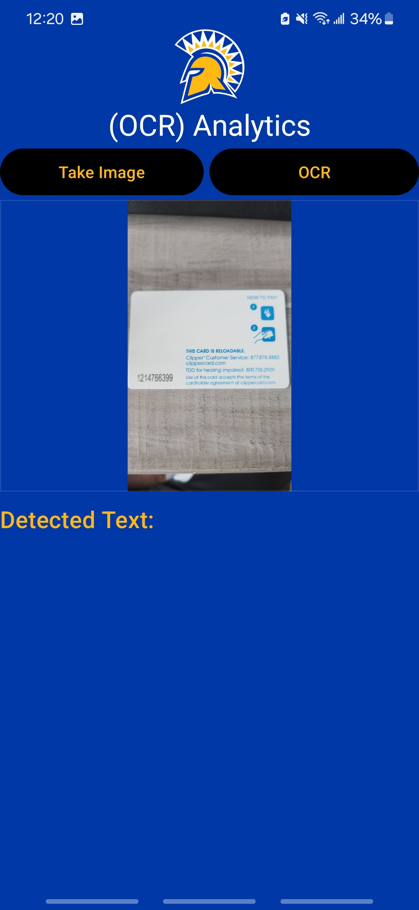

# CMPE277 ORC App - Cognitive Services and The optical character recognition (OCR) Analytics

## Assignmet Learning Objective

Purpose of the assignment is to integrate Machine Learning and AI as part of the Android Application.

## Authors

- [@Harshil-V](https://github.com/Harshil-V/)
- [@Chandrasekar Vuppalapati](chandrasekar.vuppalapati@sjsu.edu)

## Screenshots

  

    
  

  

    
  

  

    
  

  

    
  

   

    
  

  

    
  

## Notes

- If possible, test the OCR feature on a real device. Sometimes, issues that appear in an emulator might not occur on a real device due to the differences in hardware and software environments.

## Features

- **Image Capture**: Users can capture images using the device's camera, facilitated by intuitive handling of camera permissions.
- **Text Recognition**: The app accurately recognizes and extracts text from captured images using Google ML Kit's OCR technology.
- **User-Friendly Interface**: With a simple and responsive design, users can easily navigate the app and complete text recognition tasks.
- **Progress Indication**: A progress dialog keeps users informed about the status of the text recognition process, ensuring a smooth experience.

## How It Works

1. **Permissions**: On first use, the app requests necessary permissions for camera access, crucial for capturing images for OCR processing.
2. **Capturing Images**: Users can capture images using the camera. This functionality allows for digitizing handwritten notes, printed documents, and more into editable text.
3. **Text Recognition**: After capturing an image, the app employs Google ML Kit's OCR technology for text recognition. The technology's advanced algorithms ensure high accuracy and efficiency.
4. **Displaying Recognized Text**: The app displays the recognized text, allowing users to review and use the digitized information.

## Using Google ML Kit for OCR

The CMPE277 ORC App is Google ML Kit's OCR technology, which enables the app to offer rapid and precise text recognition. Here's how it works:

- **Image Preparation**: Upon capturing an image, it is converted into an `InputImage` object, a required format for ML Kit processing.
- **Text Recognition Process**: The `TextRecognizer` instance processes the `InputImage` asynchronously, ensuring the app remains responsive.
- **Result Handling**: Successful recognition returns a `Text` object, containing the extracted text along with additional information like text blocks and their positions.
- **Error Handling**: If recognition fails, users are notified through a toast message, maintaining a good user experience under all circumstances.
